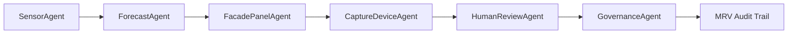

# Architecture Overview

## High-Level Architecture

RegenExcalibur uses a GCP-first architecture with a small set of secure, auditable building blocks:

- Cloud Run hosts the API/service facade for operational endpoints.
- Cloud Functions ingests event-driven tasks from Pub/Sub.
- Pub/Sub coordinates asynchronous agent work and MRV audit events.
- Cloud Storage stores generated artifacts, manifests, and video render outputs.
- Vertex AI is reserved for model-backed forecasting, enrichment, and video pipeline extensions.
- Cloud Build handles repeatable deployment workflows.
- Cloud Monitoring, Cloud Logging, and alert policies provide health visibility.
- Secret Manager holds runtime configuration and sensitive values.
- IAM service accounts separate automation, runtime service, and function execution duties.

## Deployment Flow

1. The master script validates local tools and GCP authentication.
2. Required GCP APIs are enabled.
3. Terraform provisions foundational resources.
4. Cloud Run and Cloud Functions are deployed from local source.
5. Cloud Build can be triggered for CI/CD repeatability.
6. Monitoring dashboards and alert policies can be applied.
7. The multi-agent orchestrator performs a dry-run or live coordination cycle.

## Agent Flow

## Data and Event Flow

- Sensor data enters through Pub/Sub or Cloud Run.
- Forecast jobs prepare structured predictions and confidence metrics.
- Facade panel and capture device tasks create implementation work items.
- Human review gates sensitive decisions.
- GovernanceAgent emits MRV records for auditability.
- Video and AI outputs are stored in Cloud Storage.

## Security Boundaries

- Runtime service accounts are separate from deployment service accounts.
- Secrets are referenced by name and must not be hard-coded.
- Terraform avoids storing secret values in state.
- Cloud Run and Cloud Functions use dedicated runtime identities.
- Logs use structured fields for traceability.

## Operational Model

The system is designed for repeatable deployment, staged rollout, and audit review. The included scripts are idempotent where practical and show explicit commands before applying changes.
